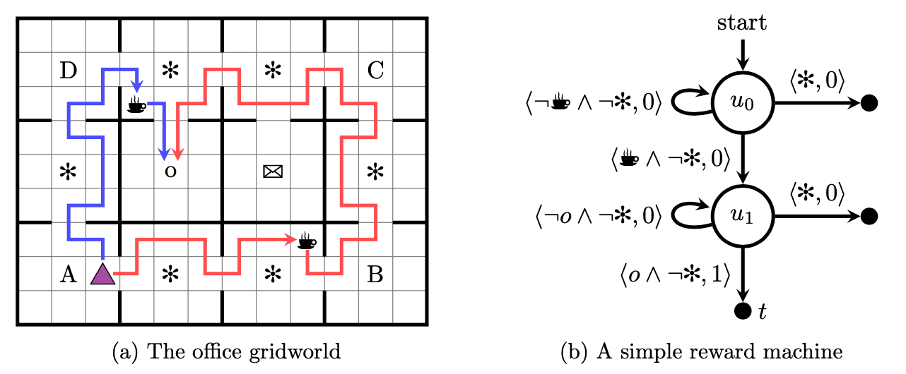
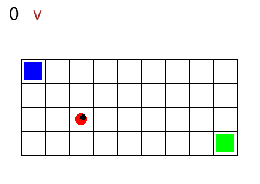

# Reasoning Agent Project

## Authors
- Appetito Daniele (<appetito.1916560@studenti.uniroma1.it>)
- Cognetta Salvatore (<cognetta.1874383@studenti.uniroma1.it>)
- Rossetti Simone (<rossetti.1900592@studenti.uniroma1.it>)

## Introduction
This project aims at solving navigation tasks with non-Markovian rewards (i.e. the *Sapientino Case* environment), developing a non-Markovian agent. However most of Reinforcement Learning (RL) theoretical frameworks expects the task to be modeled as a Markov Decision Process (MDP), meaning that state transitions are conditionally independent from history of states, for this reason RL agents can not directly solve such problems. In temporal goals, next state and reward do depend on sequence of states and actions; on this purpose we need to produce an extended MDP, combining RL agents with automata. In particular we use *Deterministic Finite Automata* (DFAs) transitions to train a set of experts, independent agents specialized in reaching their own subgoal, using an off-policy algorithm, derived from Q-learning,  named Deep Q-Networks (DQN). Additionally we exploited the knowledge of the DFA to speed up the learning process of the experts by an adaptation of the *Counterfactual Experiences for Reward Machines (CRM)* algorithm.

## DQN
The DQN (Deep Q-Network) algorithm was developed by DeepMind (Mnih et al.) in 2015. The algorithm was developed by enhancing a classic RL algorithm called Q-learning with deep neural networks and a technique called *experience replay*. "Q" refers to the function that the algorithm computes, the expected rewards for an action taken in a given state.  

The DQN learns a function approximator (a neural network with parameters ), to estimate the Q-values, i.e. 
, by minimizing the temporal distance error using the loss at each step :  
 
which is minimized for  meaning that the estimated Q-values are as close as possible to the expected reward discount (this and the next reward), i.e. if this condition holds for every state (the loss is minimized) then we have the optimal Q-table. Minimization is performed by using stochastic gradient descent over mini-batches of *experience replay*.

## Counterfactual Experiences for Reward Machines (CRM)
*Counterfactual Experiences for Reward Machines* is an algorithm by Icarte et al. which exploit the information in the reward machine (RM) to facilitate learning. It aims at learning policies  (with  the agent's policy,  the distribution over the actions,  the observation and  the reward machine state) but uses counterfactual reasoning to generate *synthetic experiences*.  



The key idea behind CRM is about enhancing the exploration of the reward machine state space, it allows the agent to reuse experience to learn the right behaviour at different RM states. Given the cross-state , the agent perform an action  and observe the new cross-state  and get a reward . We can exploit the reward machine to experience more outcomes of the cross-state and speed up the training. In fact after have performed the actual experience , we can accumulate more experience collecting, for each RM state , the resulting rewards  and outcomes  and generate the set of experiences:  

  

For both DQN and DDPG, the counterfactual experiences would simply be added to the experience replay buffer and then used for learning as is typically done with these algorithms.

CRM also converges to optimal policies when combined with q-learning and this is a theorem in Icarte et al., 2020:  
**Theorem** Given an MDPRM (Markov Decision Process with Reward Machine), CRM with tabular q-learning converges to an optimal policy for the problem in the limit (as long as every state-action pair is visited infinitely often).

## Gym SapientinoCase
In Gym SapientinoCase we have a planar unicycle robot that can move inside  a 2-D environment, which is basically a rectangular map with some coloured cells. The goal of the agent-robot is to visit the coloured cells of a continuous state space in a specific order. SapientinoCase has a low–dimensional observation space, which allows to use simple Feed–Forward Neural Networks. 



<!-- TODO: finish with some examples -->

# Setup the project

## Clone the repository
Open a terminal and download the repo via git:
```bash
git clone https://github.com/SalvatoreCognetta/reasoning-agent-project.git  
cd reasoning-agent-project
```  

## Install conda
Install miniconda with the bash script:
```bash
sudo bash conda_setup.sh
```

## Create conda virtual environment and install packages
### Create the env 
Create the virtual environment with python and pytorch (cpu) installed:  
```bash
conda create -y --name raenv python=3.8.5
```

Activate the environment:  
```bash
conda activate raenv
```

Install tensorforce:  
```bash
pip install tensorforce==0.6.5
```

Install sapientino-case: 
```bash
cd gym-sapientino-case-master && pip install .
```

### Install Lydia
Make sure to have [Lydia](https://github.com/whitemech/lydia) 
installed on your machine.
We suggest the following setup:

- [Install Docker](https://www.docker.com/get-started)
- Download the Lydia Docker image:
```bash
docker pull whitemech/lydia:latest
```
- Make the Docker image executable under the name `lydia`.
  On Linux and MacOS machines, the following commands should work:
```bash
echo '#!/usr/bin/env sh' > lydia
echo 'docker run -v$(pwd):/home/default whitemech/lydia lydia "$@"' >> lydia
sudo chmod u+x lydia
sudo mv lydia /usr/local/bin/
```

This will install an alias to the inline Docker image execution
in your system PATH. Instead of `/usr/local/bin/`
you may use another path which is still in the `PATH` variable.

## Run the project
In order to train the net:  
`python main.py --exploration=0.3 --num_colors=3`

---
## Known Erros: Numpy
If you get an error like this:
**TypeError: concatenate() got an unexpected keyword argument 'dtype'
**
The problem is the unsupported numpy version, upgrading would produce tensorflow and tensorforce incompatibility. Comment line 205 of the file:
```bash
nano $HOME/.conda/envs/raenv/lib/python3.8/site-packages/gym_sapientino/wrappers/observations.py
```
---

# Modification on temprl framework
## Clone temprl project for synthetic experience
In order to modify the temprl repo (used by gym-sapientino-case), before the installation of this repo, clone temprl in another directory:  
```bash
git clone https://github.com/SalvatoreCognetta/temprl.git 
cd temprl
git checkout develop
```

For the code look at the [GitHub repository](https://github.com/SalvatoreCognetta/temprl/tree/develop).

## Modify TemporalGoalWrapper class
Changes are done in `TemporalGoalWrapper` class inside temprl/wrapper.py.  
After a modification on the temprl forked project:
1. push the modifications;
2. remove the directories of temprl inside conda env via: `rm -rvf /home/NAME_TO_CHAGE/anaconda3/envs/raenv/lib/python3.8/site-packages/temprl*` (bug of poetry: [virtual env not updates]([https://link](https://github.com/python-poetry/poetry/issues/2921) ))
3. reinstall gym-sapientino via `cd gym-sapientino-case-master && pip install .`

---
## References
- Sutton, Richard S. and Barto, Andrew G. 2018.Reinforcement Learning: An Introduction(second ed.). <https://mitpress.mit.edu/books/reinforcement-learning-second-edition>.
- Schulman, J. and Wolski, F. and Dhariwal, P. and Radford, A. and Klimov, O. 2017. Proximal policy optimization algorithms <https://arxiv.org/abs/1707.06347>
- Icarte, R. T. and Klassen, T. Q. and Valenzano, R. and McIlraith, S. A. 2020.   Reward machines: Exploiting reward function structure in reinforcement learning. <https://arxiv.org/abs/2010.03950>
